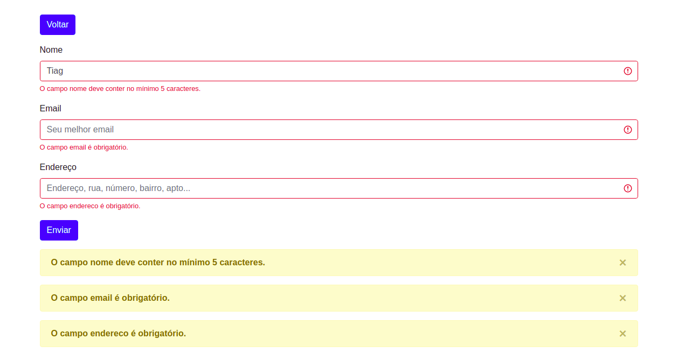

# Validação de Formulários com Laravel

Este projeto utiliza a validação de erros da Laravel juntamente com classes BootStrap para mostrar erros de uma forma a facilitar a melhor compreensão do usuário. 

Também foi utilizada a tradução para o idioma Português do Brasil disponível em resositório público do GitHub.

